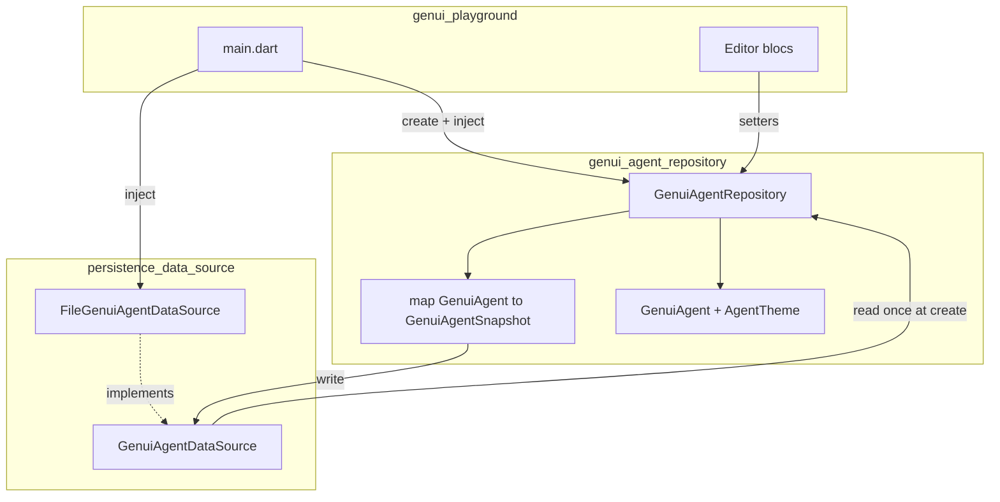

# Agent File Persistence (.genuiagent)

## What We're Building

Persist the playground’s **single** GenUI agent to disk as **JSON** in a file with the custom extension **`.genuiagent`**. For v1, use **one temp file** (no multi-agent library, no Save As UI).

| Concern | v1 behavior |
|---------|-------------|
| Format | JSON document, extension `.genuiagent` |
| Location | `{temporaryDirectory}/genui_playground/default.genuiagent` |
| Save | **Debounced auto-save** (400ms after last write request) |
| Load | On launch, **restore from file if it exists and parses**; otherwise app defaults |
| Scope | `name`, `description`, `instructions`, `theme` only |
| Components / tools | **Out of scope** until OpenUI types are JSON-serializable; always hydrated from `standardLibrary()` in `main.dart` |

**Packages:**

| Package | Role |
|---------|------|
| **`persistence_data_source`** (new, Flutter) | `GenuiAgentSnapshot`, JSON codec, `GenuiAgentDataSource` port, `FileGenuiAgentDataSource` (debounce + file I/O) |
| **`genui_agent_repository`** (existing, pure Dart) | `GenuiAgent`, `AgentTheme`, `GenuiAgentRepository` — maps domain ↔ snapshot; calls data source on mutations |

Blocs **do not** call the data source. They keep using repository setters only.

## Why This Approach

### Repository + injected data source — **Yes (chosen)**

`GenuiAgentRepository` is constructed with a **`GenuiAgentDataSource`**. A static **`GenuiAgentRepository.create`** loads once via `dataSource.read()`, builds `GenuiAgent` (app supplies `standardLibrary()` components/tools + default theme fallback). Each setter updates memory, builds a `GenuiAgentSnapshot`, and calls `dataSource.write(snapshot)`. Debouncing and file I/O stay inside `FileGenuiAgentDataSource`.

- **Pros:** Single persistence path; blocs unchanged; testable with `InMemoryGenuiAgentDataSource`; matches VGV repository/data-source split.
- **Cons:** Async app bootstrap before `runApp`.
- **Best when:** Persistence is transparent to UI (chosen).

### Decorator repository — **No** — duplicate API surface.

### Bloc-level save — **No** — fragmented, easy to miss new setters.

### Extra codec-only package — **No** — user confirmed **one new package** only.

## Architecture



### Dependency rules

```
genui_playground
  → genui_agent_repository → persistence_data_source (interface + snapshot types only)
  → persistence_data_source (Flutter: path_provider, dart:io)
```

- **`persistence_data_source` does not import `openui_core`.** No `Component` / `Tool` on disk in v1.
- **`genui_agent_repository`** depends on `persistence_data_source` for `GenuiAgentDataSource` and `GenuiAgentSnapshot` only.
- **App** wires `FileGenuiAgentDataSource` and passes `standardLibrary()` into `create`.

### `persistence_data_source`

| Type | Responsibility |
|------|----------------|
| `GenuiAgentSnapshot` | `schemaVersion`, `name`, `description`, `instructions`, `theme` map (six ARGB ints + `fontFamily`) |
| Codec | `toJson` / `fromJson`; reject unknown `schemaVersion` |
| `GenuiAgentDataSource` | `Future<GenuiAgentSnapshot?> read()`; `void write(GenuiAgentSnapshot)` (schedules debounced persist) |
| `FileGenuiAgentDataSource` | Temp path; debounce 400ms; coalesce rapid writes; on read failure return `null` |
| `InMemoryGenuiAgentDataSource` | Test double (no debounce required) |

### `genui_agent_repository`

| API | Behavior |
|-----|----------|
| `GenuiAgentRepository.create({ required GenuiAgentDataSource dataSource, required Library library, required AgentTheme defaultTheme, ... })` | `read()` → map to `GenuiAgent` with `library.components/tools`; use defaults for missing fields |
| `setName` / `setDescription` / `setInstructions` / `setTheme` | `copyWith` → `_persist()` → `dataSource.write(snapshot)` |
| Setters | Remain **synchronous**; errors in file write do not block UI |

### App bootstrap (`main.dart`)

```dart
final dataSource = FileGenuiAgentDataSource();
final repository = await GenuiAgentRepository.create(
  dataSource: dataSource,
  library: standardLibrary(),
  defaultTheme: slateLightAgentTheme(),
);
runApp(RepositoryProvider.value(value: repository, child: ...));
```

## Key Decisions

1. **One new package:** `persistence_data_source` (Flutter) — snapshot, codec, data source, debounced file I/O.
2. **Repository owns domain mapping** and is the only caller of `write`.
3. **Debounced auto-save** inside `FileGenuiAgentDataSource` (400ms).
4. **Load on startup** via `GenuiAgentRepository.create`.
5. **Temp file:** `{temporaryDirectory}/genui_playground/default.genuiagent`.
6. **v1 payload:** metadata + theme; components/tools from `standardLibrary()` at runtime.
7. **Blocs unchanged.**
8. **`schemaVersion: 1`** for forward-compatible OpenUI component/tool fields later.
9. **Write failures:** log only in v1 (no snackbar).
10. **Corrupt / missing file:** treat as no saved agent (`read` → `null`).

## Example .genuiagent (schema v1)

```json
{
  "schemaVersion": 1,
  "name": "My Agent",
  "description": "...",
  "instructions": "...",
  "theme": {
    "primary": 4281234567,
    "onPrimary": 4294967295,
    "background": 4294967295,
    "onBackground": 4278190080,
    "accent": 4283215696,
    "onAccent": 4294967295,
    "fontFamily": "Inter"
  }
}
```

## Testing (planning hint)

| Layer | Focus |
|-------|--------|
| `persistence_data_source` | JSON round-trip, debounce coalescing, corrupt file → `null` |
| `genui_agent_repository` | `create` with fake data source; setters invoke `write` with expected snapshot |
| App | Optional smoke: edit → restart → fields restored |

## Open Questions

- Whether `AgentTheme` mapping duplicates fields in repository or snapshot exposes `toAgentTheme()` helper — implementation detail.
- Log sink for write errors (`dart:developer` vs `debugPrint`) — implementation detail.

## Out of scope (v1)

- Multiple agents / picker UI
- Save As / Open dialogs
- Components and tools in `.genuiagent` (blocked on OpenUI JSON)
- User-visible persistence errors
