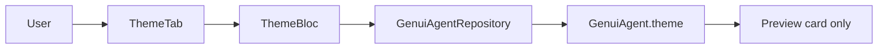

# feat: Theme page for agent visual identity — Standard

## Overview

Add a **Theme** tab that edits `GenuiAgent.theme` (`AgentTheme`): six colors, one Google Font family, with live preview on the tab. Persist each change to `GenuiAgentRepository` (Definition-tab pattern). Other shell tabs keep default Shad slate in v1.

## Problem Statement / Motivation

The Theme nav item is a placeholder. Agents need a durable visual identity (colors + font) for future GenUI export, but users need a safe place to edit and preview without re-theming the whole playground yet.

## Proposed Solution

> **Technical review (2026-05-22):** Use pure-Dart `AgentTheme` in repository; Shad/Google Fonts only in app. Prefer **2 PRs** (domain → UI). Simplified file list below.

### Domain (`genui_agent_repository`) — PR 1

1. Add `AgentTheme` (pure Dart — **no Flutter `Color`**):

```dart
// packages/genui_agent_repository/lib/src/agent_theme.dart
class AgentTheme {
  const AgentTheme({
    required this.primaryArgb,
    required this.onPrimaryArgb,
    required this.backgroundArgb,
    required this.onBackgroundArgb,
    required this.accentArgb,
    required this.onAccentArgb,
    required this.fontFamily,
  });

  final int primaryArgb;
  // ... other ARGB ints
  final String fontFamily;

  AgentTheme copyWith({...});
}
```

2. Extend `GenuiAgent` with `theme` (required; no Shad in package).

3. `GenuiAgentRepository` — **`setTheme(AgentTheme theme)`** (single write path; UI builds `copyWith` locally).

4. Export `agent_theme.dart`.

5. **Defaults in app**, not repository:

```dart
// lib/agent_theme_editor/agent_theme_defaults.dart
AgentTheme slateLightDefaults() {
  final scheme = const ShadSlateColorScheme.light();
  return AgentTheme(
    primaryArgb: scheme.primary.toARGB32(),
    // ... map 6 slots + fontFamily: 'Geist' (or bundled default)
  );
}
```

6. `main.dart` passes `theme: slateLightDefaults()` into `GenuiAgent`.

### App feature (`lib/agent_theme_editor/`) — PR 2

Mirror `description_editor` naming (avoid bare `ThemeBloc` vs `ShadTheme`):

| File | Responsibility |
|------|----------------|
| `agent_theme_editor/agent_theme_editor.dart` | Barrel |
| `bloc/agent_theme_editor_bloc.dart` | `AgentThemeUpdated(AgentTheme)` → `setTheme` + emit |
| `bloc/agent_theme_editor_state.dart` | `@MappableClass()` holding `AgentTheme` |
| `bloc/agent_theme_editor_event.dart` | Sealed events |
| `view/agent_theme_editor_page.dart` | `BlocProvider` |
| `view/agent_theme_editor_view.dart` | 6 swatches, font search, **preview card** (merge + font load) |
| `view/view.dart` | Barrel |
| `agent_theme_color_extensions.dart` | `int` ↔ `Color` for pickers |

### Shell wiring (PR 2)

```dart
// lib/shell/view/shell_view.dart
ShellTab.theme => const AgentThemeEditorPage(),
```

### Preview boundary (locked for v1)

- **Default Shad:** Header, labels, pickers, font search.
- **Merged agent theme:** Preview card subtree only (`ShadTheme.merge` — no `ShadAnimatedTheme` in v1).

### Shad + font application (presentation only)

`AgentTheme.applyTo(ShadThemeData base)` extension in app maps ARGB → `ShadColorScheme.copyWith(...)`.

**Font async lives in preview `StatefulWidget`** (not bloc): `GoogleFonts.getFont`, cancel stale futures, spinner / error / fallback — keeps bloc synchronous.

### Google Fonts picker (v1)

- Dependency: `google_fonts: ^6.x`
- Data: `GoogleFonts.asMap().keys` or documented list API for search (no remote API in v1)
- UX: `ShadInput` + debounced filter (300ms); dropdown / list of matches; tap selects family
- Empty search results: “No fonts match”
- Loading: spinner overlay on preview card while font loads
- Failure: preview shows “Couldn’t load font” + fallback to `AgentTheme.slateLightDefaults().fontFamily`

### Color pickers (v1)

- Use Flutter `ColorPicker` / platform dialog OR `showDialog` with a simple HSV picker package if needed — prefer minimal new deps; `flex_color_picker` only if Shad has no picker.
- **Hex:** display-only under each swatch (synced from picker)
- Persist on picker **close/confirm** (not every drag tick if picker is modal); if inline picker, debounce 200ms
- Opaque colors only (`alpha` = 0xFF)

### `main.dart`

Pass `theme: AgentTheme.slateLightDefaults()` when constructing initial `GenuiAgent`.

## Technical Considerations

- **Architecture:** Feature module + repository domain; no theme logic in shell bloc.
- **Performance:** Debounce font search; cancel stale `GoogleFonts` futures.
- **Security:** Google Fonts loads from Google CDN — document network requirement.
- **Testing:** `packages/genui_agent_repository/test/` for `setTheme` + `AgentTheme.copyWith`; app `bloc_test` for `AgentThemeEditorBloc`; one widget test for preview (optional v1). Add `bloc_test` + `mocktail` to app dev_dependencies.

## User flows (summary)



| Flow | Behavior |
|------|----------|
| Open Theme | Bloc reads `genuiAgent.theme` |
| Change color | Repo + emit → preview updates |
| Change font | Repo + emit → preview loading → font applied |
| Leave tab | Bloc disposed; data on agent |
| Return | Fresh bloc reads persisted theme |
| Other tabs | Unchanged default Shad |

## Acceptance Criteria

- [ ] `AgentTheme` + `GenuiAgent.theme` with `slateLightDefaults()` in repository package
- [ ] `GenuiAgentRepository` updates theme fields; covered by unit tests
- [ ] Theme tab replaces shell placeholder; nav shows Theme with palette icon
- [ ] Six labeled color pickers map to agent tokens; hex display-only
- [ ] Google Font search selects family; canonical name stored on agent
- [ ] Each color/font change updates repository immediately (no Save button)
- [ ] Preview card uses merged theme; chrome (header/pickers) uses default Shad
- [ ] Font loading shows spinner; failure shows error + fallback font in preview
- [ ] Definition / Catalog / Tools tabs visually unchanged after theme edits
- [ ] Leaving and re-entering Theme tab shows last values
- [ ] `flutter analyze` clean; hot reload after changes during dev

## Success Metrics

- User can set all six colors and a Google Font and see them in preview without leaving Theme tab.
- Theme data lives on `GenuiAgent` for future export (no playground-only type).

## Dependencies & Risks

| Risk | Mitigation |
|------|------------|
| Manual `on*` contrast | Document; no blocker in v1 |
| Font CDN offline | Error UI + fallback |
| Font load race | Request id / ignore stale |
| No global theme yet | Subtitle on Theme tab explains scope |

## PR split (recommended)

| PR | Scope | Merge first |
|----|--------|-------------|
| **PR 1** | `AgentTheme`, `GenuiAgent.theme`, `setTheme`, tests, `main.dart` defaults | — |
| **PR 2** | `lib/agent_theme_editor/`, `google_fonts`, shell wire, widget/bloc tests | PR 1 |

Single PR is acceptable if the team prefers one review for one tab (~800 LOC).

## Implementation order

**PR 1**

1. `agent_theme.dart` + `GenuiAgent` / `setTheme` + package tests
2. `agent_theme_defaults.dart` + `main.dart`

**PR 2**

3. `agent_theme_editor` bloc + page
4. Color pickers + `AgentThemeUpdated` on commit
5. Font search (cached `GoogleFonts` family list) + preview card
6. Shell wire-up
7. `bloc_test` + manual QA; hot reload after edits

## References & Research

- Brainstorm: `docs/brainstorm/2026-05-22-theme-page-brainstorm-doc.md`
- Patterns: `lib/description_editor/bloc/description_editor_bloc.dart`, `lib/shell/view/shell_view.dart`
- Shad mapping: `primaryForeground`, `foreground`, `accentForeground` on `ShadColorScheme`
- OpenUI catalog unchanged: `lib/catalog/view/catalog_view.dart` uses `standardLibrary()`

## Out of scope (follow-ups)

- Apply agent theme to whole `ShadApp`
- Theme in OpenUI `Renderer` / catalog previews
- Auto-contrast for `on*` colors
- Font weight picker
- Theme JSON export
- Disk persistence / reset-to-defaults button
