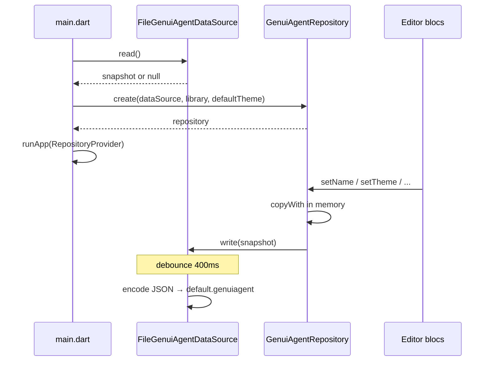

## feat: persist agent to .genuiagent file — Standard

## Overview

Add disk persistence for the playground’s single GenUI agent using a **`.genuiagent`** JSON file in the system temp directory. Introduce one new Flutter package, **`persistence_data_source`**, and extend **`genui_agent_repository`** so `GenuiAgentRepository` accepts a **`GenuiAgentDataSource`**, loads on startup, and writes debounced snapshots after mutations. UI blocs stay unchanged.

**Brainstorm:** `docs/brainstorm/2026-05-23-agent-file-persistence-brainstorm-doc.md`

## Problem Statement / Motivation

Today agent state lives only in memory (`GenuiAgentRepository`). Closing the app loses name, description, instructions, and theme. Users need automatic persistence while editing, without multi-agent UI or export dialogs in v1.

## Proposed Solution

### Package layout

```
packages/
├── genui_agent_repository/     # existing — add create(), mapping, persist hooks
└── persistence_data_source/    # NEW — pure Dart: snapshot, codec, port, file IO + debounce
```

### Dependency graph

```
genui_playground (Flutter app)
  → genui_agent_repository → persistence_data_source
  → persistence_data_source (only if app constructs FileGenuiAgentDataSource directly)
```

`persistence_data_source` **must not** import `openui_core` or the Flutter SDK.

**Technical review note:** Use `dart:io` + `Directory.systemTemp` for the temp path (macOS/desktop v1). Do **not** add `path_provider` to the persistence package — that would force Flutter into the package `genui_agent_repository` depends on.

### Data flow



### File format (schema v1)

- Path: `{temporaryDirectory}/genui_playground/default.genuiagent`
- Fields: `schemaVersion`, `name`, `description`, `instructions`, `theme` (six ARGB ints + `fontFamily`)
- Components/tools: **not** stored; always from `standardLibrary()` at `create`

### API sketch

**`persistence_data_source`**

| File | Types |
|------|--------|
| `lib/persistence_data_source.dart` | barrel |
| `lib/src/genui_agent_snapshot.dart` | immutable DTO + `toJson` / `fromJson` |
| `lib/src/genui_agent_data_source.dart` | abstract `read()`, `write()`, `Future<void> flush()` |
| `lib/src/file_genui_agent_data_source.dart` | debounced IO |
| `lib/src/in_memory_genui_agent_data_source.dart` | test double |

**`genui_agent_repository`**

| Change | Detail |
|--------|--------|
| `pubspec.yaml` | `persistence_data_source: path: ../persistence_data_source` |
| `genui_agent_repository.dart` | `static Future<GenuiAgentRepository> create({...})` |
| Mapping helpers | `GenuiAgentSnapshot fromAgent(GenuiAgent)`, `GenuiAgent mergeSnapshot(...)` |
| Setters | After `copyWith`, call `_dataSource.write(fromAgent(_genuiAgent))` |
| Sync constructor | Keep for tests without persistence |

**`lib/main.dart`**

```dart
Future<void> main() async {
  WidgetsFlutterBinding.ensureInitialized();
  final library = standardLibrary();
  final dataSource = FileGenuiAgentDataSource();
  final repository = await GenuiAgentRepository.create(
    dataSource: dataSource,
    library: library,
    defaultTheme: slateLightAgentTheme(),
  );
  runApp(RepositoryProvider(create: (_) => repository, child: const MainApp()));
}
```

## Technical Considerations

### Architecture

- Repository is the **only** writer to the data source.
- Snapshot mapping lives in `genui_agent_repository` to keep OpenUI types out of the persistence package.
- `FileGenuiAgentDataSource` owns debounce timer and pending snapshot (last-write-wins).

### Bootstrap

- `main` is `async`; await `create` before `runApp` so blocs never read empty defaults while a valid file exists.
- **No file write on first launch** — file created on first user mutation only.

### Debounce & lifecycle

- Debounce: **400ms** after last `write()` call.
- **`flush()`** on `GenuiAgentDataSource`: immediately persist pending snapshot.
- App wires `WidgetsBindingObserver` (or `AppLifecycleState.detached` / `paused`) to call `dataSource.flush()` so edits within the debounce window are not lost on quit.

### Read semantics

| Condition | Result |
|-----------|--------|
| File missing | `null` → app defaults |
| Invalid JSON / wrong `schemaVersion` | `null` → app defaults (do not delete file in v1) |
| Valid JSON | Map to agent; empty strings in file are honored; missing `theme` uses `defaultTheme` |

### Write semantics

- Setters remain synchronous; IO errors logged via `dart:developer` `log()`; no UI feedback in v1.
- Temp directory may be cleared by OS — next launch uses defaults (document as best-effort).

### Performance

- Debounce avoids disk write per keystroke.
- Single small JSON file.

### Security

- API keys are unrelated; file is local temp only.
- Do not log snapshot contents in production builds.

## Implementation tasks

### Phase 1 — `persistence_data_source` package (PR 1)

- [ ] Scaffold `packages/persistence_data_source` (**pure Dart**, `sdk: ^3.11.5`, `very_good_analysis`, barrel export)
- [ ] Implement `GenuiAgentSnapshot` + codec with `schemaVersion: 1`
- [ ] Implement `GenuiAgentDataSource` abstract class
- [ ] Implement `InMemoryGenuiAgentDataSource`
- [ ] Implement `FileGenuiAgentDataSource` (`dart:io`, system temp + `genui_playground/default.genuiagent`, debounce, `flush`, corrupt read → `null`; injectable `Directory` for tests)
- [ ] Unit tests: round-trip JSON, unknown schema, debounce coalescing (`fake_async` or injectable clock — no real 400ms sleeps in CI), flush writes immediately

### Phase 2 — `genui_agent_repository` (PR 2)

- [ ] Add path dependency on `persistence_data_source`
- [ ] Add snapshot mapping (`AgentTheme` ↔ theme map)
- [ ] Add `GenuiAgentRepository.create` with `read()` + `standardLibrary()` hydration
- [ ] Inject `GenuiAgentDataSource`; call `write` from all four setters
- [ ] Keep existing sync constructor for tests
- [ ] Unit tests: `create` with `mocktail` fake data source; **all four setters** invoke `write`; mapping tests (`AgentTheme` ARGB round-trip, partial snapshot defaults)
- [ ] Sync constructor: optional `GenuiAgentDataSource?` defaulting to no-op or in-memory for existing tests
- [ ] `Future<void> flush()` on repository delegating to data source

### Phase 3 — App integration (PR 3)

- [ ] Add `persistence_data_source` to app `pubspec.yaml`
- [ ] Update `lib/main.dart` to async bootstrap + `create`; use `RepositoryProvider.value(value: repository, ...)`
- [ ] Lifecycle: `WidgetsBindingObserver` in `main.dart` (or thin wrapper) calls `repository.flush()` on `paused` / `detached`
- [ ] Update `README.md` persistence section (temp file, auto-save behavior)

### Phase 4 — Verification

- [ ] `dart test` in both packages
- [ ] `flutter test` at app root
- [ ] Manual smoke (see Test plan)

## Acceptance Criteria

- [ ] Agent edits to name, description, instructions, and theme persist to `{temp}/genui_playground/default.genuiagent`
- [ ] Relaunch restores those fields when file is valid
- [ ] Missing or corrupt file falls back to defaults without crash
- [ ] Debounced writes coalesce rapid edits
- [ ] `flush()` on app background prevents loss within debounce window
- [ ] Components and tools always come from `standardLibrary()`, not disk
- [ ] Blocs require no changes
- [ ] No user-visible error UI for IO failures in v1

## Test plan

| Scenario | Steps | Expected |
|----------|-------|----------|
| First launch | Fresh install / delete temp file | Empty definition, default theme; no file until first edit |
| Save + restart | Edit name + theme, wait >400ms, quit, relaunch | Values restored |
| Debounce | Type quickly, quit after >400ms from last key | Last value saved |
| Debounce loss (mitigated) | Edit, quit within 400ms without background | With lifecycle `flush`, still saved |
| Corrupt file | Replace file with `{` | App launches with defaults |
| Components tab | After restore | Still shows standard library catalog |

## Success Metrics

- Definition and Theme survive app restart in manual QA
- Package tests green in CI
- No regression in existing bloc tests

## Dependencies & Risks

| Risk | Mitigation |
|------|------------|
| Temp dir cleared by OS | Document; future Save As out of scope |
| Accidental Flutter in persistence package | Pure Dart package only; file path via `dart:io` `Directory.systemTemp` |
| OpenUI JSON for components/tools | `schemaVersion` reserved; follow-up when OpenUI ships |

## References & Research

- Brainstorm: `docs/brainstorm/2026-05-23-agent-file-persistence-brainstorm-doc.md`
- Repository: `packages/genui_agent_repository/lib/src/genui_agent_repository.dart`
- Bootstrap: `lib/main.dart`
- Writers: `lib/description_editor/bloc/description_editor_bloc.dart`, `lib/agent_theme_editor/bloc/agent_theme_editor_bloc.dart`
- Prior theme plan (persistence deferred): `docs/plan/2026-05-22-feat-theme-page-plan.md`

## PR split (technical review)

| PR | Scope | Merge order |
|----|--------|-------------|
| **1** | `persistence_data_source` package + tests | First |
| **2** | Repository `create`, mapping, setter `write` + tests (app unchanged) | Second |
| **3** | App wiring, lifecycle `flush`, README, smoke | Third |

Feature is user-visible only after PR 3; PRs 1–2 keep CI green.

## Out of scope

- Multiple agents
- Save As / Open dialogs
- Components/tools in `.genuiagent`
- User-visible persistence errors
- Deleting corrupt files automatically
